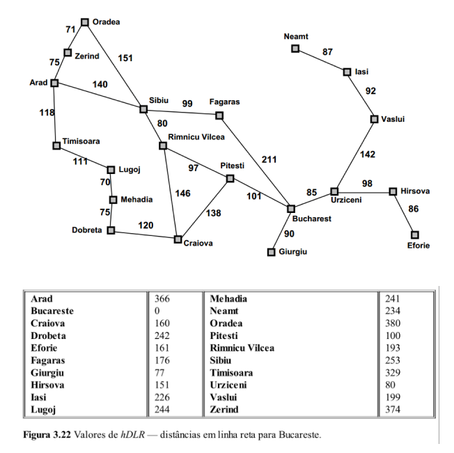

Curso de Especialização de Inteligência Artificial Aplicada

Setor de Educação Profissional e Tecnológica - SEPT

Universidade Federal do Paraná - UFPR

---

**IAA003 - Linguagem de Programação Aplicada**

Prof. Alexander Robert Kutzke

Estudante: Bruno Moreira Ribas

# Exercício de implementação do Algoritmo A*.

Implemente a função `a_star` do arquivo [main.py](main.py) presente no repositório.

O destino será sempre **Bucharest**.

O arquivo [dists.py](dists.py) descreve estruturas de dados que representam as
seguintes informações:

